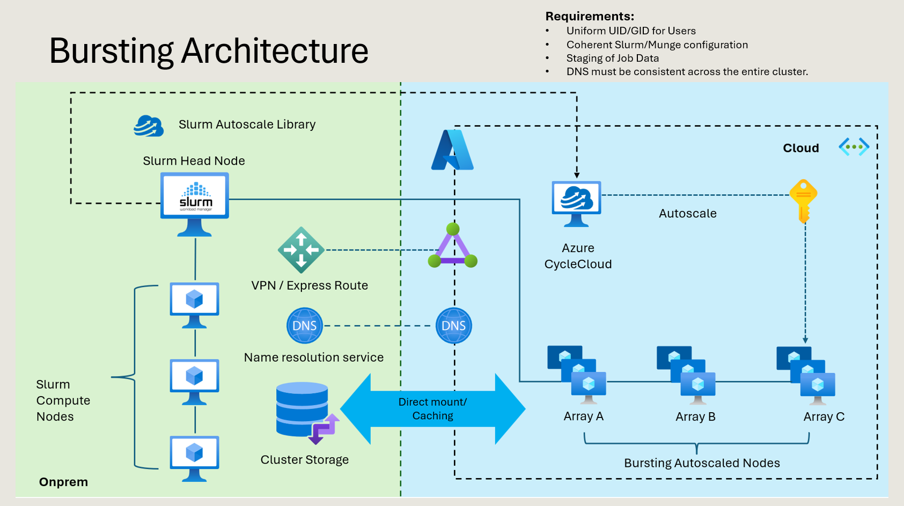

# Enabling Slurm Cloud Bursting in Hybrid HPC Environments with Azure CycleCloud

This comprehensive tutorial demonstrates how organizations can extend their on-premises High Performance Computing (HPC) capacity using hybrid HPC and cloud-bursting strategies with Azure. Through the integration of Slurm with Azure CycleCloud, computational jobs can seamlessly overflow into cloud resources when local capacity is exhausted.

This hands-on guide covers the complete workflow from initial setup to validation, including establishing prerequisites, configuring a headless Slurm cluster in CycleCloud, connecting external Slurm schedulers, implementing shared file systems, and conducting end-to-end bursting validation.

## Learning Objectives

By completing this tutorial, participants will:

- Gain comprehensive understanding of Azure CycleCloud and CycleCloud Workspace for Slurm capabilities
- Learn to design and implement hybrid HPC environments using Azure CycleCloud and Slurm
- Master cloud bursting mechanisms within HPC workflows
- Acquire practical experience through guided hands-on demonstrations

## Understanding Azure CycleCloud

Azure CycleCloud serves as an enterprise-grade orchestration platform for managing High Performance Computing environments within Azure. This sophisticated tool enables organizations to provision HPC infrastructure, deploy industry-standard schedulers, and implement automatic scaling to execute workloads efficiently at any scale.

### Key Features

- **Azure Marketplace Integration**: Seamlessly available through Microsoft Azure Marketplace
- **Intuitive Management Interface**: Provides both user-friendly GUI and robust CLI/API capabilities  
- **Scheduler Compatibility**: Supports widely-adopted schedulers including Slurm, PBS, LSF, and others
- **Infrastructure Orchestration**: Manages complete infrastructure provisioning and autoscaling operations
- **Cost Optimization**: Simplifies cost management and governance across HPC deployments

**Documentation**: [Azure CycleCloud Overview](https://learn.microsoft.com/en-us/azure/cyclecloud/overview?view=cyclecloud-8)

## Azure CycleCloud Workspace for Slurm

The Azure CycleCloud Workspace for Slurm represents a turnkey Azure Marketplace solution that eliminates the complexity traditionally associated with cloud HPC deployments. This comprehensive template deploys a complete Slurm environment optimized for large-scale artificial intelligence and HPC workloads, enabling operational readiness within minutes.

This ready-to-deploy solution allows organizations to create and deploy fully configured Slurm environments on Azure without requiring extensive prior knowledge of Azure or Slurm technologies. The workspace includes pre-configured components:

- **Slurm Workload Manager**: Complete scheduling and resource management
- **PMIx v4**: Process Management Interface for scalable systems
- **Pyxis and Enroot**: Container runtime solutions for AI/HPC workloads
- **Cendio ThinLinc**: Remote desktop access capabilities
- **Open OnDemand**: Web-based cluster portal interface

Upon deployment, users can immediately connect to login nodes via SSH or Visual Studio Code and begin executing Slurm workloads. While Azure CycleCloud provides robust cluster orchestration capabilities, it typically requires manual infrastructure configuration. The CycleCloud Slurm Workspace automates this entire process, delivering a production-ready environment.

**Documentation**: [CycleCloud Workspace for Slurm Overview](https://learn.microsoft.com/en-us/azure/cyclecloud/overview-ccws?view=cyclecloud-8)

## What is Hybrid HPC?

### Blending On-Premises and Cloud Infrastructure

Hybrid HPC represents the strategic combination of existing on-premises HPC resources with the elastic, on-demand capabilities of public cloud platforms like Azure. This approach addresses critical organizational challenges while maximizing computational efficiency and cost-effectiveness.

Organizations implementing hybrid HPC solutions typically face several operational constraints that this architecture helps resolve:

### Common Pain Points Addressed

- **Extended Queue Wait Times**: Traditional fixed-capacity environments often result in significant job queuing delays
- **Capacity Limitations**: Static on-premises infrastructure cannot accommodate variable workload demands
- **Capital Expenditure Burden**: High upfront costs for hardware procurement and maintenance
- **Resource Utilization Inefficiencies**: Underutilized resources during low-demand periods

### Technical Challenges in Hybrid Implementation

Successfully implementing hybrid HPC requires addressing several technical considerations:

- **Data Gravity**: Managing data locality and transfer costs between on-premises and cloud environments
- **Network Latency**: Ensuring acceptable performance across distributed computing resources
- **Scheduler Integration**: Seamless coordination between on-premises and cloud-based schedulers
- **Name Resolution**: Consistent DNS and hostname management across hybrid environments
- **User Identity Management**: Maintaining unified authentication and authorization systems

## What is Cloud Bursting?

### Dynamic Cluster Extension

Cloud bursting represents a sophisticated mechanism where on-premises schedulers, such as Slurm, automatically redirect overflow computational jobs to cloud-based compute nodes when local capacity reaches saturation. This dynamic scaling approach optimizes resource utilization while maintaining cost efficiency.

The cloud bursting process operates through several key characteristics:

- **On-Demand Provisioning**: Cloud nodes are created dynamically based on immediate job requirements
- **Automatic Decommissioning**: Resources are terminated automatically upon job completion to minimize costs
- **CycleCloud Integration**: Leverages Azure CycleCloud autoscale library features for seamless scaling operations

### Key Technical Considerations

Successful cloud bursting implementation requires careful attention to several technical requirements to ensure seamless operation between on-premises and cloud environments:

#### Network Connectivity
Establishing reliable, secure communication channels between environments is fundamental. This typically involves implementing Site-to-Site VPN connections or Azure ExpressRoute for consistent, high-performance networking.

#### Shared Storage Systems  
Both environments must maintain access to common filesystems, often implemented through Network File System (NFS) or Azure NetApp Files. This shared storage ensures consistent access to home directories, application binaries, and job input/output data.

#### Identity Management
Maintaining consistent user and group identities (UIDs/GIDs) across environments is essential for security and data access. Organizations typically implement LDAP or Active Directory integration to ensure identity consistency.

#### DNS Resolution
Consistent name resolution across the entire hybrid cluster is critical for proper node communication and job execution. This requires careful DNS configuration and often involves private DNS zones.

## Labs Overview

The following Lab exercises provide a comprehensive walkthrough for building and validating a complete hybrid HPC environment using Azure CycleCloud Workspace for Slurm. These exercises simulate realistic hybrid architecture by deploying a standalone Slurm cluster within Azure that represents a traditional on-premises environment.

This simulated external cluster operates independently of CycleCloud initially, allowing participants to experience how conventional on-premises HPC systems can be extended into Azure cloud resources. Once the simulated on-premises Slurm environment is established, the integration with Azure CycleCloud enables comprehensive cloud bursting capabilities.

The Lab progression follows a logical sequence where Slurm automatically provisions cloud compute nodes when local resources become insufficient. These structured exercises guide participants through each implementation phase, from network preparation through cluster deployment to complete bursting operations, providing clear understanding of hybrid HPC workflows.

Each Lab builds systematically upon previous exercises, progressively assembling the complete end-to-end hybrid configuration. Upon completion, participants will operate a fully functional hybrid HPC environment capable of dynamic scaling into Azure based on computational demand.

### Architecture Overview



## Prerequisites

The following section outlines essential components required for constructing the hybrid HPC environment. These resources will be created systematically through the step-by-step Lab exercises rather than requiring advance provisioning. This overview provides conceptual understanding of the infrastructure that will be deployed during the tutorial progression.

### Network Infrastructure Requirements

The hybrid environment depends on dual virtual networks and unified name resolution systems. Lab exercises will guide you through:

1. **On-Premises Virtual Network (onprem)**: Hosting simulated on-premises Slurm infrastructure
2. **Cloud Virtual Network (cloud)**: Hosting Azure CycleCloud environment and cloud-burst compute resources  
3. **Network Peering**: Establishing bidirectional connectivity between on-premises and cloud components
4. **Private DNS Zone Configuration**: Implementing consistent cluster-wide name resolution (e.g., hpc.internal domain)

### Simulated On-Premises Cluster Components

Lab exercises will deploy the following components within the onprem network to represent traditional datacenter infrastructure:

1. **Scheduler Virtual Machine**: Azure D4s_v5 instance hosting Slurm controller
2. **Compute Virtual Machine**: Azure D4s_v5 instance for local job execution  
3. **Slurm Installation**: Version 24.05.4-2 for on-premises cluster management
4. **Centralized Storage**: NFS-based system for home directories and shared Slurm configuration (Azure NetApp Files recommended for production environments)

### Cloud Environment Components

Within the cloud network, Lab exercises will guide deployment of:

1. **Azure CycleCloud Workspace**: Slurm version 2025.09.15 for cloud orchestration
2. **Cloud Compute Resources**: HPC-optimized instances such as Azure HB120rs_v3 with InfiniBand networking support

### Supporting Resources

Automation scripts and configuration files used throughout the Lab are maintained in this repository:

**Repository**: [https://github.com/vinil-v/cyclecloud-hybrid-hpc-lab](https://github.com/vinil-v/cyclecloud-hybrid-hpc-lab)

These resources will be referenced throughout the exercises to streamline configuration processes and ensure consistent deployment procedures.

## Lab Exercises

### Lab 0: Preparing Networks for Bursting

This foundational Lab establishes the networking infrastructure required to support hybrid HPC environments and enable cloud bursting capabilities. The objective is to create a network topology that facilitates seamless communication between simulated on-premises environments and Azure-based compute resources.

The exercise involves creating dual virtual networks representing on-premises datacenter and cloud environments, then establishing secure, routable connectivity between them. Additionally, a Private DNS zone deployment ensures consistent name resolution across both environments, which is essential for reliable Slurm node communication during bursting operations.

#### Lab Steps

1. **Resource Group Creation**: Establish a dedicated Azure resource group for logical organization and management of all Lab components

2. **On-Premises Virtual Network Deployment**: Create the VNet hosting simulated on-premises Slurm scheduler and compute nodes, representing customer-operated datacenter networks

3. **Cloud Virtual Network Deployment**: Establish the VNet hosting Azure CycleCloud environment and cloud-bursting compute resources

4. **VNet Peering Configuration**: Implement VNet peering to provide complete bidirectional connectivity between networks. Note: Production environments typically use ExpressRoute or Site-to-Site VPN, but VNet peering provides sufficient connectivity for simulation purposes

5. **Private DNS Zone Implementation**: Configure Azure Private DNS zone for centralized name resolution across all nodes in both VNets, critical for Slurm communication and stable host identity during bursting

Upon completing Lab 0, you will have established a fully connected and resolvable network foundation supporting all subsequent Lab exercises involving cluster deployment and cloud bursting.

### Lab 0 Video Tutorial — Network Preparation for Hybrid HPC

[](https://youtu.be/RtCXP_YmuYM)


### Lab 1: Creating an Azure-Only HPC Cluster

This Lab focuses on deploying the foundational Azure-based HPC environment using Azure CycleCloud Workspace for Slurm. This environment serves as the baseline cloud cluster before integrating on-premises components. Participants gain practical experience with CycleCloud deployment workflows and familiarization with management interfaces and command-line tools.

#### Primary Learning Activities

1. **Azure CycleCloud Workspace Deployment**: Deploy CycleCloud Workspace from Azure Marketplace, providing a fully configured Slurm environment including login nodes, scheduler, and ready-made HPC workload configuration

2. **Initial Azure-Only HPC Cluster Creation**: Using CycleCloud web interface or CLI, create and launch a standalone Slurm cluster operating entirely within Azure. This cluster validates job submission, cluster configuration, and baseline autoscaling behavior before hybrid integration

3. **CycleCloud CLI Operations**: Install and configure CycleCloud CLI, exploring essential commands for cluster management, node state monitoring, job initiation, and programmatic CycleCloud interaction. These CLI operations are critical for automation and subsequent Lab exercises involving cloud bursting

#### Reference Documentation

- [Deploy CycleCloud Workspace for Slurm Quickstart](https://learn.microsoft.com/en-us/azure/cyclecloud/qs-deploy-ccws?view=cyclecloud-8)
- [CycleCloud CLI Reference](https://learn.microsoft.com/en-us/azure/cyclecloud/cli?view=cyclecloud-8)


### Lab 1 Video Tutorial: Creating Azure-Only HPC Cluster

[](https://www.youtube.com/watch?v=CkzIVCgrdI8)


Upon completing Lab 1, you will have a functioning Azure-only Slurm environment and comprehensive understanding of CycleCloud core capabilities, preparing for on-premises cluster integration in subsequent exercises.

### Lab 2: Simulating the "On-Premises" HPC Cluster

This Lab simulates an on-premises HPC environment by deploying a standalone Slurm cluster in Azure. This external cluster operates independently from CycleCloud and serves as the "on-premises" environment during hybrid integration and cloud bursting exercises. The goal is recreating conditions of traditional datacenter-managed Slurm environments, complete with dedicated schedulers and compute resources.

#### Implementation Steps

1. **Scheduler VM Creation**: Provision a virtual machine within the onprem VNet to function as the Slurm controller (slurmctld). This node hosts the scheduler, shared configuration files, and NFS exports as required

2. **Compute VM Creation**: Deploy a second virtual machine functioning as the Slurm compute node (slurmd). This node registers with the scheduler and participates in local job execution

3. **On-Premises Slurm HPC Cluster Configuration**: Install required Slurm version, configure slurm.conf and supporting files, establish shared storage, ensure consistent user identity, and validate node communication. Upon completion, you will have a fully functioning standalone Slurm cluster mirroring on-premises deployments

#### Commands and Procedures

##### Scheduler Node Configuration

Follow these steps to configure the on-premises Slurm scheduler:

1. **Access Scheduler VM**: Log in to the Scheduler VM as root user

2. **Repository Cloning**:
   ```bash
   git clone https://github.com/vinil-v/cyclecloud-hybrid-hpc-lab.git
   ```

3. **Navigate to Configuration Directory**:
   ```bash
   cd cyclecloud-hybrid-hpc-lab/scheduler/
   ```

4. **Execute Slurm Scheduler Build Script**:
   ```bash
   sh 01_slurm-scheduler-builder.sh
   ```

5. **Provide Required Configuration Details**:
   ```
   Building Slurm scheduler for cloud bursting with Azure CycleCloud
   Enter Cluster Name: demo
   Enter the Slurm version to install (You get this from the cyclecloud_build_cluster.sh, eg:24.05.4-2): 24.05.4-2
   ```

6. **Review Configuration Summary**: Upon successful completion, review the summary output. The script configures Munge, initializes Slurm, and displays the NFS server IP address required for subsequent configuration.

   ```
   ________________________________________
   Munge configured
   ________________________________________
   Configuring Slurm
   ________________________________________
   Slurm configured
   ________________________________________
   ```

The displayed IP address will be used for configuring shared storage in CycleCloud.

##### Compute Node Configuration

Follow these steps to configure the Slurm compute node:

1. **Access Compute VM**: Log in to the Compute1 VM as root user

2. **Repository Cloning**:
   ```bash
   git clone https://github.com/vinil-v/cyclecloud-hybrid-hpc-lab.git
   ```

3. **Navigate to Configuration Directory**:
   ```bash
   cd cyclecloud-hybrid-hpc-lab/computenode/
   ```

4. **Execute Compute Node Setup Script**:
   ```bash
   sh 01_computenode.sh
   ```

5. **Provide Configuration Parameters**:
   ```
   ------------------------------------------------------------------------------------------------------------------------------
   Building Slurm Compute node for cloud bursting with Azure CycleCloud
   ------------------------------------------------------------------------------------------------------------------------------

   Enter Cluster Name: demo
   Enter the Slurm version to install (24.05.4-2): 24.05.4-2
   Enter the NFSServer IP Address (This is the IP of the scheduler node): 10.211.0.X
   ```

6. **Verify Configuration**: Confirm Slurm is fully configured on the compute node upon script completion

##### Starting Services and Cluster Validation

1. **Start Slurm Controller Service** (on Scheduler VM):
   ```bash
   systemctl start slurmctld.service
   ```

2. **Generate Node and Partition Definitions**:
   ```bash
   sh 03-partionconf.sh
   ```

3. **Start Slurm Daemon** (on Compute1 VM):
   ```bash
   systemctl start slurmd
   ```

4. **Verify Cluster State**:
   ```bash
   sinfo
   ```
   Expected output:
   ```
   PARTITION AVAIL  TIMELIMIT  NODES  STATE NODELIST
   onprem       up   infinite      1   idle compute1
   ```

5. **Submit Test Job** (from Scheduler VM):
   ```bash
   srun -p onprem hostname
   ```
   Expected output:
   ```
   compute1
   ```

At this point, the standalone Slurm cluster running in Azure has been successfully deployed and validated.

### Lab 2 Video Tutorial  
**Simulating an On-Prem Slurm HPC Cluster in Azure**

[](https://youtu.be/X5DwMk1zLGU)


Upon completing Lab 2, you will have an operational on-premises Slurm environment ready for integration with Azure CycleCloud in subsequent Lab.

### Lab 3: Integrating the On-Premises HPC Cluster with CycleCloud

This Lab integrates the previously deployed on-premises Slurm environment with Azure CycleCloud to enable hybrid operation and cloud bursting capabilities. This integration allows CycleCloud to manage cloud-based execute nodes while the on-premises Slurm scheduler remains the primary control point. Upon completion, you will establish the communication, configuration, and shared storage required for seamless cluster extension into Azure.

#### Integration Process

1. **Slurm (headless) Cluster Template Import**: Import the Slurm (headless) template in CycleCloud interface. This template is specifically designed to provision compute-only nodes and relies on external Slurm controllers, making it ideal for hybrid bursting scenarios

2. **Template Configuration for On-Premises Scheduler**: Update template settings to reference the on-premises Slurm head node IP address. Define VM sizes, partitions, and scaling behavior for CycleCloud-managed cloud nodes

3. **Shared NFS Mount Configuration**: Establish shared filesystem accessible to both on-premises and cloud nodes. This may be hosted on the on-premises scheduler or implemented using Azure NetApp Files. Shared storage ensures consistent access to home directories, configuration files, and job scripts

4. **CycleCloud Connection Script Execution**: Execute the CycleCloud-provided integration script on the on-premises Slurm head node. The script updates slurm.conf with cloud-specific configurations, enabling the controller to recognize and manage cloud bursting partitions. After this step, the scheduler becomes fully cloud-aware

#### Implementation Commands and Procedures

##### CycleCloud Environment Setup

1. **CycleCloud VM Access**: Log in as hpcadmin user. If this is the first time using CycleCloud on the VM, initialize it:
   ```bash
   cyclecloud initialize
   ```

   Example:
   ```
   [hpcadmin@ccw-cyclecloud-vm ~]$ cyclecloud initialize
   CycleServer URL: [http://localhost]
   Detected untrusted certificate. Allow?: [yes]
   Using https://localhost
   CycleServer username: [hpcadmin]
   CycleServer password:
   Generating CycleServer key...
   Initial account already exists, skipping initial account creation.
   CycleCloud configuration stored in /home/hpcadmin/.cycle/config.ini
   ```

2. **Package Installation**:
   ```bash
   sudo yum install git vim -y
   ```

3. **Repository Cloning**:
   ```bash
   git clone https://github.com/vinil-v/cyclecloud-hybrid-hpc-lab.git
   ```

4. **Navigate to CycleCloud Script Directory**:
   ```bash
   cd cyclecloud-hybrid-hpc-lab/cyclecloud/
   ```

5. **Execute Template Preparation Script**: This script displays project version, Slurm version, and headless Slurm template location:
   ```bash
   sh 01_prep_cyclecloud-slurm_template.sh
   ```

   Example output:
   ```
   Project version: 3.0.12
   Slurm version: 24.05.4-2
   Template location: slurm-3.0.12/templates/slurm-headless.txt

   Please refer README for customizing the template for Headless Slurm cluster
   ```

##### Headless Slurm Template Preparation

To configure CycleCloud to manage cloud-only execute nodes, remove the following sections completely from the template file:

- `[[node scheduler]]`
- `[[nodearray scheduler-ha]]`
- `[[nodearray login]]`
- `[[[parameter SchedulerMachineType]]]`
- `[[[parameter loginMachineType]]]`
- `[[[parameter NumberLoginNodes]]]`
- `[[[parameter SchedulerHostName]]]`
- `[[[parameter SchedulerImageName]]]`
- `[[[parameter LoginImageName]]]`
- `[[[parameter SchedulerClusterInitSpecs]]]`
- `[[[parameter LoginClusterInitSpecs]]]`
- `[[[parameter SchedulerZone]]]`
- `[[[parameter SchedulerHAZone]]]`

These sections are removed to ensure the template is fully headless, meaning it includes only cloud compute nodes and does not deploy scheduler or login nodes in Azure.

##### Cluster Import Process

1. **Copy Customized Template**:
   ```bash
   cp template/slurm-headless.txt slurm-3.0.12/templates/
   ```

2. **Import Cluster**:
   ```bash
   sh 02_cyclecloud_build_cluster.sh
   ```

   Example interaction:
   ```
   Enter Cluster Name: demo
   Cluster Name: demo
   Importing cluster Slurm and creating cluster demo....
   demo : off
   Resource group:
   Cluster nodes: 0

   Please make a note of the following details:
   Cluster Name: demo
   Project version: 3.0.12
   Slurm version: 24.05.4-2
   ```

##### CycleCloud Portal Configuration

In the CycleCloud User Interface:

1. Navigate to **Clusters → demo → Edit**
2. Modify VM SKUs as required for your workload
3. Select the Cloud VNet for network configuration
4. Update the Network Attached Storage section and provide the scheduler (NFS server) IP for `/sched` and `/shared` mount points

5. Save the configuration changes

**Start the CycleCloud Cluster**: Start demo cluster from the CycleCloud UI.

##### On-Premises Scheduler Integration

1. **Execute CycleCloud Integrator Script** (on Scheduler VM):
   ```bash
   cd ~/cyclecloud-hybrid-hpc-lab/scheduler
   sh 02_cyclecloud-integrator.sh
   ```

   Provide integration details when prompted:
   ```
   Enter Cluster Name: demo
   Enter CycleCloud Username: hpcadmin
   Enter CycleCloud Password:
   Enter the Project version: 3.0.12
   Enter CycleCloud URL (e.g., https://10.222.1.19): https://10.212.0.X
   ```

   Ensure:
   - Cluster Name matches the CycleCloud cluster name
   - Project Version matches the value from earlier scripts
   - CycleCloud URL is reachable from the scheduler VM (private IP recommended)

2. **Enable Slurm Autoscaling**: Uncomment the following lines in `/etc/slurm/slurm.conf`:
   ```
   PrologSlurmctld=/opt/azurehpc/slurm/prolog.sh
   ResumeProgram=/opt/azurehpc/slurm/resume_program.sh
   ResumeFailProgram=/opt/azurehpc/slurm/resume_fail_program.sh
   SuspendProgram=/opt/azurehpc/slurm/suspend_program.sh
   ```

   Verify configuration:
   ```bash
   grep azurehpc /etc/slurm/slurm.conf
   ```

   These scripts enable Slurm autoscaling functionality with Azure CycleCloud.

3. **Restore On-Premises Partition Configuration**: The file `/etc/slurm/azure.conf` may be overwritten during Azure cluster imports. Execute the following script to restore on-premises node entries:
   ```bash
   sh 03-partionconf.sh
   ```

   This ensures on-premises nodes remain part of the Slurm configuration.

### Lab 3 Video Tutorial  
**Integrate On-Prem Slurm with Azure CycleCloud for Bursting**

[](https://www.youtube.com/watch?v=qoyLRuccoto)


Upon completing Lab 3, your Slurm environment will be fully hybrid-enabled, with CycleCloud ready to provision compute capacity dynamically in response to scheduler demand. This integration establishes the foundation for testing live bursting behavior in the final Lab exercise.

### Lab 4: Bursting in Action

This final Lab validates the complete hybrid HPC workflow by observing Slurm cloud bursting in real-time. With the on-premises Slurm environment integrated into Azure CycleCloud, the scheduler can automatically provision cloud compute nodes when local capacity is fully utilized. This exercise demonstrates the full lifecycle of bursting—from idle cloud nodes to automated provisioning, job execution, and eventual deallocation.

#### Validation Workflow

1. **Node State Inspection**: Before submitting jobs, check sinfo on the on-premises scheduler. Cloud partitions and nodes should appear in a powered-down state, indicated by the ~ symbol

2. **Workload Submission**: Submit workloads that exceed local compute capacity. This triggers Slurm to evaluate cloud partitions for additional resources

3. **CycleCloud Activity Monitoring**: In the CycleCloud interface, monitor how Slurm requests new cloud nodes. CycleCloud begins provisioning them based on defined scaling policies

4. **Azure Portal VM Monitoring**: As cloud nodes are requested, new virtual machines automatically appear in the Azure portal. These nodes are initialized, configured, and added to the Slurm cluster

5. **Job Progress Monitoring**: Jobs transition from Pending (PD) while nodes are provisioning to Running (R) once cloud nodes become available

6. **Automatic Node Teardown Validation**: After job completion and configurable idle timeout, CycleCloud gracefully deallocates cloud nodes, returning the environment to baseline state

#### Commands and Implementation Steps

##### User Account Management

1. **Create User in CycleCloud Web Portal**: Log in to the CycleCloud Web GUI and create a new user (e.g., vinil). Assign the following roles:
   - **Global Node User**
   - **Administrator**


   After creating the user, note the UID, which will be required to maintain consistent UID/GID across the on-premises scheduler and compute nodes.

   **Note**: If a centralized user management system (e.g., LDAP, AD) is available, creating local users manually is not required.

2. **Create User on Scheduler VM**: Log in to the Scheduler VM as root and execute the user creation script:
   ```bash
   cd ~/cyclecloud-hybrid-hpc-lab/scheduler
   sh useradd_example.sh
   ```

   Provide the username, UID, and GID when prompted:
   ```
   Enter User Name: vinil
   Enter User ID (UID): 20003
   Enter Group ID (GID): 20003
   Generating public/private rsa key pair.
   Your identification has been saved in /shared/home/vinil/.ssh/id_rsa
   Your public key has been saved in /shared/home/vinil/.ssh/id_rsa.pub
   ...
   User vinil created with UID 20003 and GID 20003
   ```

   This script creates the user and configures passwordless SSH access.

3. **Create User on Compute Node**: Log in to the Compute1 node as root and execute the same script:
   ```bash
   cd ~/cyclecloud-hybrid-hpc-lab/computenode
   sh useradd_example.sh
   ```

   Enter the same username, UID, and GID:
   ```
   Enter User Name: vinil
   Enter User ID (UID): 20003
   Enter Group ID (GID): 20003
   User setup completed for vinil with UID: 20003 and GID: 20003
   ```

   This ensures consistent identity management across the environment.

##### Test Job Execution

1. **User Session Access**: Log in directly as vinil or switch users:
   ```bash
   su - vinil
   ```

2. **Repository Access**:
   ```bash
   git clone https://github.com/vinil-v/cyclecloud-hybrid-hpc-lab.git
   ```

3. **Navigate to Test Directory**:
   ```bash
   cd cyclecloud-hybrid-hpc-lab/test/
   ```

   This directory contains example scripts for testing Slurm workloads.

4. **Submit Cloud Job**: Submit the sample cloud workload, which requests two cloud nodes and performs an MPI PingPong test over InfiniBand:
   ```bash
   sbatch cloudjob.sh
   ```

   Example output:
   ```
   Submitted batch job 2
   ```

5. **Monitor Job and Cluster Status**: Check job status:
   ```bash
   squeue
   ```

   Example output:
   ```
   JOBID PARTITION NAME      USER  ST  TIME  NODES NODELIST(REASON)
       2       hpc my_cloud  vinil CF  1:23      2 demo-hpc-[1-2]
   ```

   Check node state:
   ```bash
   sinfo
   ```

   Example output:
   ```
   vinil@compute1:~/cyclecloud-hybrid-hpc-lab/test$ sinfo
   PARTITION AVAIL  TIMELIMIT  NODES  STATE  NODELIST
   dynamic      up   infinite      0    n/a
   gpu          up   infinite      2  idle~  demo-gpu-[1-2]
   hpc*         up   infinite      2   mix~  demo-hpc-[1-2]
   hpc*         up   infinite      4  idle~  demo-hpc-[3-6]
   htc          up   infinite     50  idle~  demo-htc-[1-50]
   ```

   You can also observe the cloud node provisioning process from the CycleCloud Web UI.

6. **Verify Output Files**: After job completion, review generated output in the job directory to confirm successful execution.

### Lab 4 Video Tutorial  
**Cloud Bursting Validation**
[](https://www.youtube.com/watch?v=GTfkRo4YMNk)

Completing Lab 4 confirms that your hybrid HPC environment is fully operational and capable of scaling dynamically using Azure-based cloud bursting.

## Conclusion

This comprehensive tutorial demonstrates the complete implementation of hybrid HPC environments using Azure CycleCloud and Slurm. Through these structured Lab exercises, participants gain practical experience with:

- **Network Infrastructure Design**: Establishing secure, scalable connections between on-premises and cloud environments
- **Cluster Integration**: Seamlessly connecting existing HPC infrastructure with cloud resources  
- **Automated Scaling**: Implementing dynamic resource provisioning based on workload demands
- **Cost Optimization**: Leveraging pay-per-use cloud resources to supplement fixed on-premises capacity

The hybrid approach presented here enables organizations to maximize their HPC capabilities while maintaining cost efficiency and operational flexibility. By combining the predictable performance of on-premises infrastructure with the elastic scalability of Azure cloud resources, organizations can effectively address variable computational demands without significant capital investment.

## Additional Resources

- [Azure CycleCloud Documentation](https://learn.microsoft.com/en-us/azure/cyclecloud/)
- [Azure CycleCloud Workspace for Slurm](https://learn.microsoft.com/en-us/azure/cyclecloud/overview-ccws?view=cyclecloud-8)
- [Slurm Workload Manager Documentation](https://slurm.schedmd.com/documentation.html)
- [Azure HPC Documentation](https://learn.microsoft.com/en-us/azure/architecture/topics/high-performance-computing/)
- [Scripts repository](https://github.com/vinil-v/cyclecloud-hybrid-hpc-lab)


## Support and Contributions

For questions, issues, or contributions to this tutorial, please refer to the [GitHub repository](https://github.com/vinil-v/cyclecloud-hybrid-hpc-lab) where you can:

- Report issues or bugs
- Suggest improvements
- Contribute enhancements
- Access the latest updates and documentation

---

**Last Updated**: December 2025  
**Version**: 1.0  
**Maintained By**: [vinil-v](https://github.com/vinil-v)
